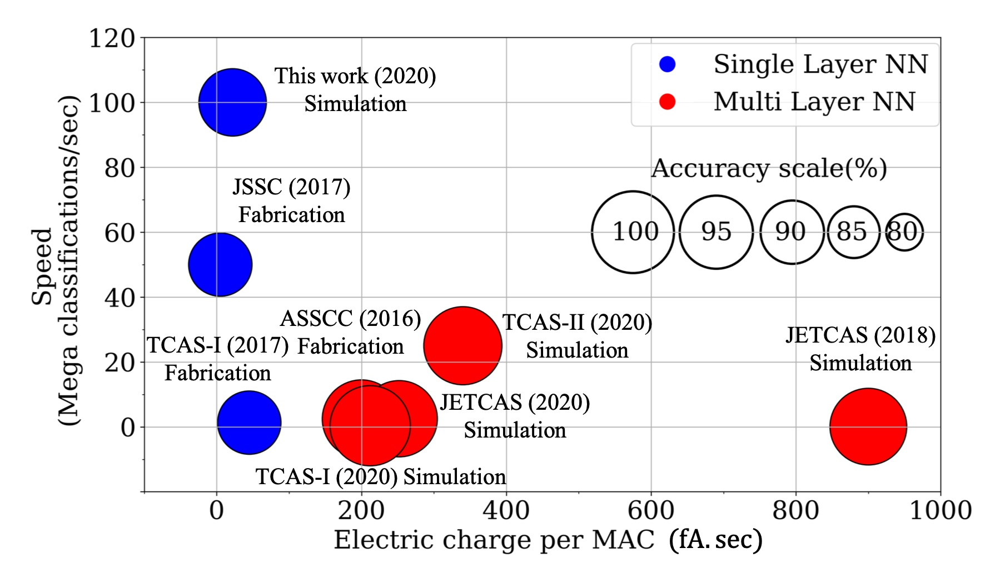

# A Single-MOSFET Analog High Resolution-Targeted (SMART) Multiplier for Machine Learning Classification

* [Abstract](#Abstract)
* [Paper](#Paper)
* [Directory](#Directory)
* [Platform](#Platform)
* [Software](#Software)
* [Simulation](#Run-Simulation)
* [Screenshots](#Screenshots)
* [Results](#Results)
* [Comparison](#Comparison-with-the-State-of-the-Art)
## Abstract
Mixed-signal machine-learning classification has recently been demonstrated as an efficient alternative for classification with power expensive digital circuits. In this paper, a single-MOSFET analog multiplier is proposed for classifying high-dimensional input data into multi-class output space with less power and higher accuracy than state-of-the-art mixed-signal linear classifiers. A high-resolution (i.e., multi-bit) multiplication is facilitated within a single-MOSFET by feeding the features and feature weights into, respectively, the body and gate inputs. High-resolution classifier that considers the decision of the individual predictors is designed at 180nm technology node and operates at 100MHz in near/subthreshold region.
To evaluate the performance of the classifier, a reduced MNIST dataset is generated by downsampling the MNIST digit images from 784 features to 48 features. The system is simulated across a wide range of PVT variations, exhibiting average accuracy of 92% (2% improvement over state-of-the-art), energy consumption of 67.3pJ per classification (over 8 times lower than state-of-the-art classifiers), area of 27,570um^2, and a stable response under PVT variations. All the code and simulation files are available at an online public GitHub repository.

## Paper
F. Kenarangi and I. P.-Vaisband, “A Single-MOSFET Analog High Resolution-Targeted (SMART) Multiplier for Machine Learning Classification,” IEEE J. on Emer. and Sel. Topics in Circuits and Syst., Dec 2021.

## Directory

* Data - (contains raw MNIST dataset, quantized features, and quantized feature weights)
* Netlist - (Contains the transistor level netlist of the SMART classifier)
* Log - (contains Log file generated upon completion of the simualtion)

* Output - (.raw file generated executing the simulation which containes the voltage waveforms of sensing lines and decision of the binary classifiers)

<!-- * Results - (screenshots of simulation environment) -->

## Platform
[CentOS Linux release 7.6.1810](https://www.centos.org/)

## Software

The simulations are performed using "Cadence (R) Virtuoso (R) Spectre (R) Circuit Simulator"

Version 15.1.0.257 64bit -- 9 Oct 2015 

Copyright (C) 1989-2015 Cadence Design Systems, Inc. All rights reserved worldwide. Cadence, Virtuoso and Spectre are registered trademarks of Cadence Design Systems, Inc. All others are the property of their respective holders.

## Run Simulation

1. Download the repository directly as a zip file or using git clone command:

`git clone https://github.com/faridken/SMART_Multiplier_for_ML.git`

2. Make sure you have downloaded the files to a directory where you can envoke spectre simulator of Cadence

3. To point to the correct component models you may need to change the ditecrly of the modesl within netlist file (the line as attached below)

`include "/opt/gpdk180_v3.3/models/spectre/gpdk.scs" section=NN"`

Also make sure that the directory to provide input features are correct (as shown below):

`VF0Bit0 (F0Bit0 0) vsource file="/home/farid/cadence_local/JETCAS/F0Bit0.p" type=pwl`

`...`

`VF47Bit0 (F47Bit0 0) vsource file="/home/farid/cadence_local/JETCAS/F47Bit0.p" type=pwl`

Note that to execute the simulation you will need Cadence's generic PDK (gpdk180) to be installed. You need to directly download it from cadence.com.

4. Go to the Netlist directory 

`cd SMART_Classifier/Netlist`

5. Enovoke the simulation using the commad below

`spectre -64 ++aps +mt netlist`

6. The simulation results will be stored in "netlist.raw" file.

7. Simulation results can be analyzed using "Virtuoso Visualisation and Analysis (ViVA)" by envoking the command below

`viva -mode xl`

## Screenshots of Simulation Environment

### Screenshot of the exhibited voltage drop on sensing lines for 0-vs-1 classifier:

### Screenshot of the exhibited votes for 0-vs-1 classifier:

## Simulation Results

The votes/decisions of binary classifiers are sampled with a frequency of 100MHz and are stored in "/Output/netlist.raw". Finally the accuracy is obtained using Python as shown below:      
### Confusion Matrix obtained for MNIST dataset: Accuracy = 92%

## Comparison-with-the-State-of-the-Art

